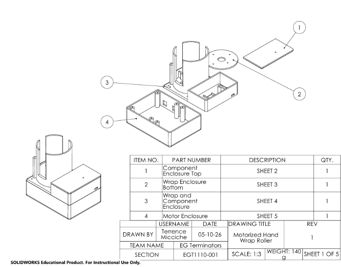
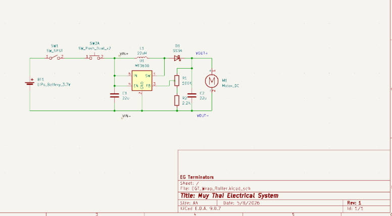
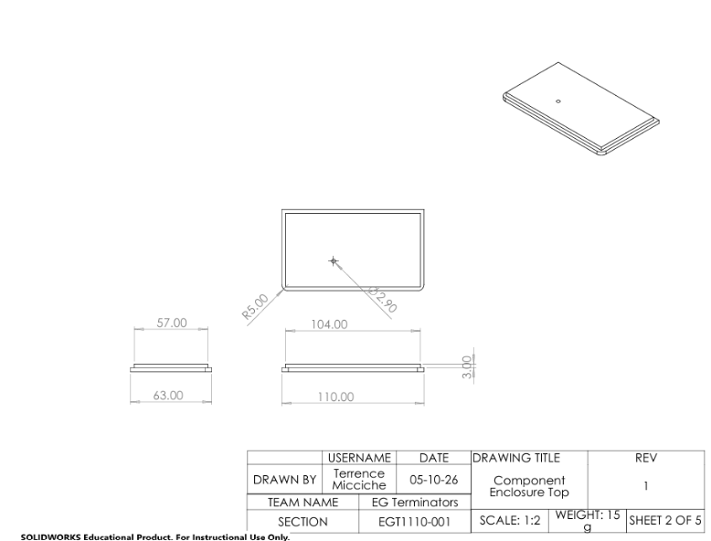

# Electronic Hand Wrap Roller

## Overview
This repository documents the development of an automated hand wrap rolling device created as part of an Engineering Graphics and Technology (EGT) team project.

The goal of the project was to design a portable system capable of automatically rolling reusable boxing or athletic hand wraps in order to improve convenience, consistency, and storage efficiency.

The project followed a structured engineering design process involving:
- Problem identification
- Concept generation
- Decision matrix analysis
- Hardware and power system design
- Prototype development
- System evaluation
- Technical documentation

The project was developed collaboratively by students with backgrounds in electrical engineering and computer science/software engineering.

---

## Project Objectives
- Design a portable wrap rolling system
- Develop an electrically powered rolling mechanism
- Evaluate multiple mechanical concepts and subsystem layouts
- Analyze power requirements and component selection
- Document engineering decisions and tradeoffs
- Create a functional prototype for demonstration purposes

---

## Engineering Focus Areas

### Electrical and Power System Design
- Battery selection and power analysis
- Motor selection and torque considerations
- Switch and control integration
- Voltage regulation using boost converters
- Power consumption evaluation

### Mechanical Design
- Wrap guidance and spool concepts
- Housing and portability considerations
- Ergonomic design evaluation
- Concept comparison through decision matrices

### Documentation and Systems Engineering
- System architecture planning
- Requirements analysis
- Stakeholder identification
- Design tradeoff analysis
- Milestone and deliverable tracking

## Development Process

The project evolved through multiple design iterations. Early concepts explored several form factors and rolling mechanisms before converging on a portable electrically driven solution.

Engineering decisions were influenced by:
- Component availability
- Power limitations
- Ease of manufacturing
- User ergonomics
- Reliability and simplicity

---

---

## Project Media

### Prototype and Design Images

Project visuals, prototype images, engineering drawings, and electrical schematics are located in the `MEDIA/` directory.

Included materials:
- CAD drawings and enclosure designs
- Electrical schematic development
- Mechanical component layouts
- Prototype and subsystem visuals
- Engineering documentation figures

### System Overview



### Electrical System



### Mechanical Design



---

## Final Documentation

The complete engineering report for the project can be found below:

[EGT Final Team Report](DOCS/EG%20Terminators%20-%20EGT%20Team%20Report.pdf)

## Educational Purpose

This repository was developed for academic and portfolio purposes as part of the EGT curriculum. The project emphasizes engineering process, subsystem integration, and technical documentation rather than commercial deployment.

---

## Contributors

Multidisciplinary student engineering team consisting of:
- Electrical engineering students
- Computer science/software engineering students

Specific subsystem responsibilities evolved throughout development as the project progressed.
---

## Repository Structure

```text
DOCS/        -> Reports, diagrams, and project documentation
HARDWARE/    -> Electrical design work and hardware analysis
SOFTWARE/    -> Software or firmware-related development
MEDIA/       -> Images, renders, and presentation visuals
